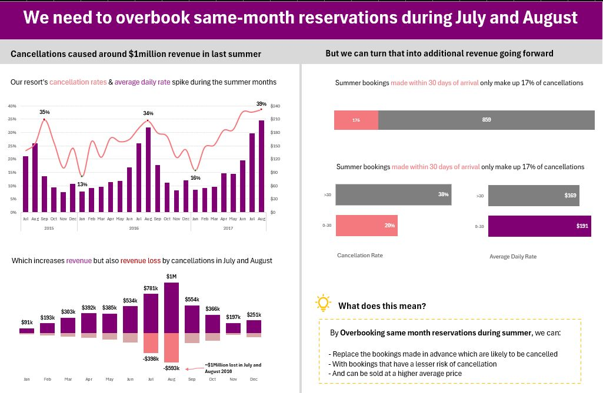

# Hotel Cancellation Analysis (Excel Project)

## Introduction

Every summer, hotels face the same painful reality: cancellations rise, revenue projections fall short, and rooms that could have been filled remain empty. For this resort group, that reality translated into approximately **$1 million in lost revenue in a single summer**.

This project analyzes three years of hotel booking data to understand:

- Why July and August generate the highest revenue losses
- Which customers are most likely to cancel
- How booking behavior impacts revenue
- What strategy the resort can adopt to reduce losses during peak season

The entire analysis was completed in **Microsoft Excel**, covering data cleaning, exploration, KPI analysis, and dashboard creation.

---

# Project Objectives

This analysis was designed to answer four key business questions:

1. When do cancellation rates spike and by how much?
2. How much revenue is being lost because of cancellations?
3. Do early bookers cancel more often than last-minute bookers?
4. What strategy can reduce revenue loss during peak summer months?

---

# Dataset Overview

The dataset contains hotel booking records collected over a three-year period.

| Column | Description |
|---|---|
| Booking ID | Unique identifier for each reservation |
| Hotel | Property type where the booking was made |
| Booking Date | Date the reservation was created |
| Arrival Date | Scheduled guest arrival date |
| Lead Time | Days between booking and arrival |
| Nights | Number of nights booked |
| Guests | Number of guests included in the reservation |
| Distribution Channel | Booking platform or booking method |
| Customer Type | Category of customer |
| Country | Guest country of origin |
| Deposit Type | Type of deposit associated with booking |
| Average Daily Rate | Average room revenue earned per occupied day |
| Status | Current booking status |
| Status Update | Date booking status was last updated |
| Cancelled | Binary indicator (1 = cancelled, 0 = not cancelled) |
| Revenue | Actual revenue earned |
| Revenue Loss | Revenue lost due to cancellation |

---

# Tools Used

- Microsoft Excel
  - Data Cleaning
  - Pivot Tables
  - Pivot Charts
  - KPI Analysis
  - Dashboard Design
  - Conditional Formatting
  - Trend Analysis

---

# Key Findings

## 1. Cancellations Spike Every Summer

Analysis of cancellation trends across all three years revealed a consistent seasonal pattern.

- July and August recorded the highest cancellation rates every year
- Cancellation rates reached as high as **39% in 2017**
- The pattern repeated annually, indicating a structural business problem rather than random fluctuation

At the same time, the **Average Daily Rate (ADR)** also increased during these months, meaning cancellations were occurring during the resort’s most profitable period.

---

## 2. Summer Cancellations Cost Nearly $1 Million

The financial impact was substantial.

### Revenue Losses in Summer 2018

- July: approximately **$593,000**
- August: approximately **$398,000**

Combined, the resort lost nearly:

# $1 Million in Revenue

These losses occurred during periods of peak demand and premium room pricing, significantly reducing potential profitability.

---

## 3. Early Bookers Cancel More and Pay Less

Segmenting bookings by lead time revealed two distinct customer behaviors.

| Booking Type | Cancellation Rate | Average Daily Rate |
|---|---|---|
| More than 30 days in advance | 38% | $169 |
| Within 30 days of arrival | 20% | $191 |

### Key Insight

Guests who booked last minute:

- Cancelled less frequently
- Paid higher nightly rates

Meanwhile, guests booking far in advance:

- Cancelled at much higher rates
- Paid lower room rates

This meant the resort was often holding rooms for high-risk reservations while turning away more profitable and reliable last-minute guests.

---

## 4. Same-Month Bookings Represented Only 17% of Cancellations

Another important finding was that bookings made within 30 days of arrival accounted for only:

# 17% of Total Summer Cancellations

This suggests that the operational risk associated with accepting more last-minute bookings is relatively low compared to the revenue risk created by early cancellations.

---

# Business Recommendation

## Implement a Controlled Overbooking Strategy for July and August

Based on the findings, the recommended strategy is to deliberately overbook **same-month reservations during peak summer months**.

### Why This Works

- Last-minute guests are less likely to cancel
- Last-minute guests pay higher ADRs
- Early bookings carry significantly higher cancellation risk
- Summer demand remains strong enough to support additional bookings

### Expected Benefits

- Higher occupancy rates
- Reduced revenue loss from cancellations
- Better room utilization
- Increased revenue per available room

The goal is not reckless overbooking, but rather a **data-informed optimization strategy** built around observed customer behavior patterns.

---

# Dashboard Preview

```md

```

---

# Conclusion

Three years of booking data revealed a clear and actionable story:

- Summer cancellations are predictable
- Revenue losses are substantial
- Early bookers create the highest cancellation risk
- Last-minute guests are both more reliable and more profitable

By implementing a controlled overbooking strategy during July and August, the resort has an opportunity to recover a significant portion of its lost summer revenue while improving overall booking efficiency.

This project demonstrates how Excel can be used not just for reporting, but for practical business analytics and strategic decision-making.

---

# Skills Demonstrated

- Data Cleaning in Excel
- Exploratory Data Analysis (EDA)
- Revenue Analysis
- Customer Segmentation
- Trend Analysis
- KPI Dashboard Design
- Business Problem Solving
- Data Visualization
- Data-Driven Recommendation Development

---

# Author

 Muh'Qoozim Muh'Jamiu
Data Analyst | Excel | SQL | Power BI | python
